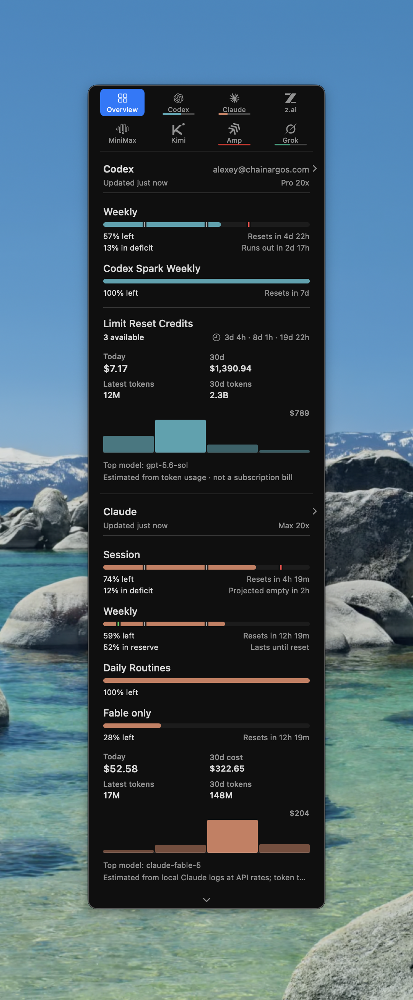
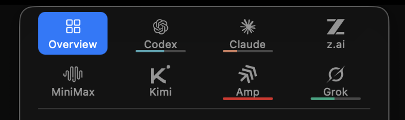
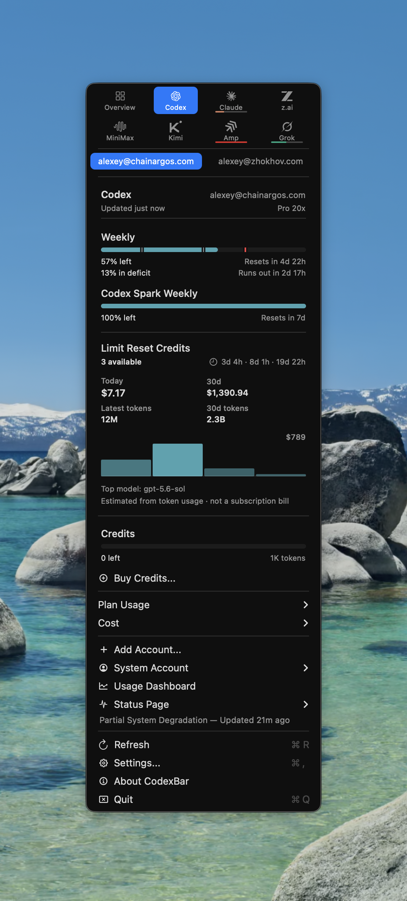
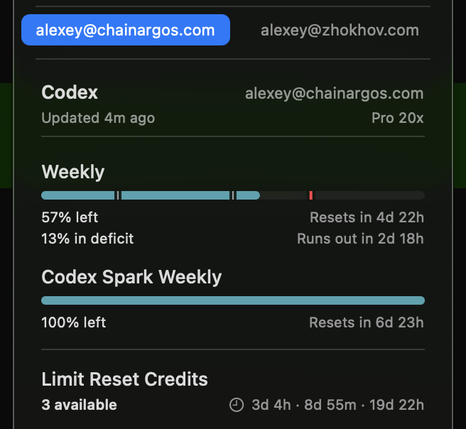
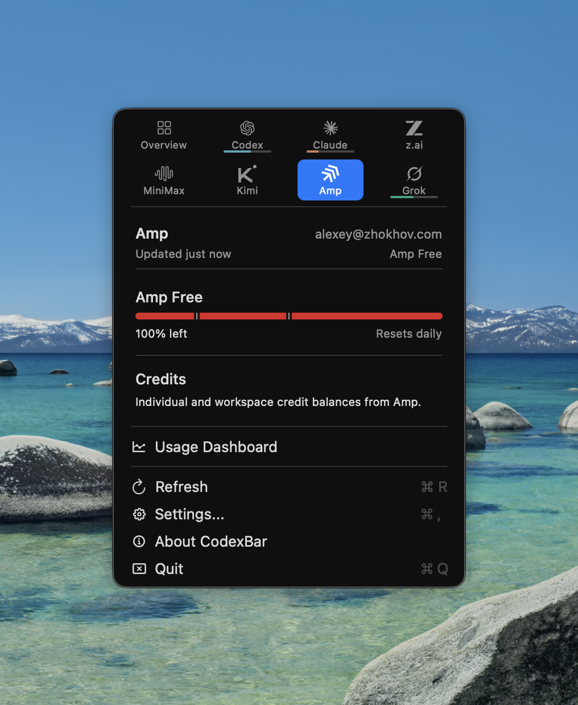
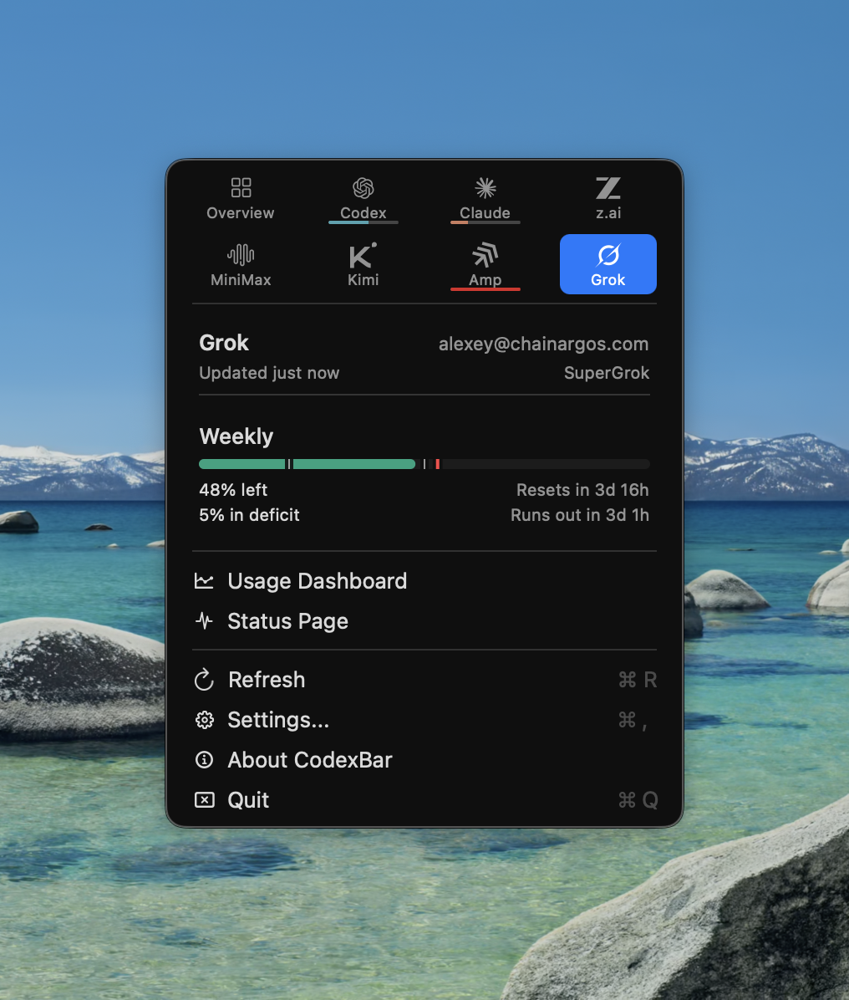
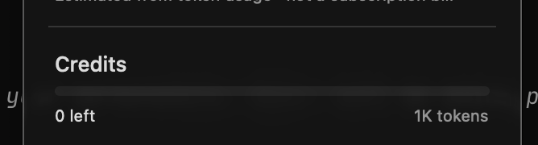

**Vetted**: 2026-07-24

These screenshots preserve visual evidence used while designing jackin❯ desktop. They are references for hierarchy and interaction, not implementation specifications. The [Desktop roadmap item](/roadmap/native-macos-usage-menu-bar/) owns remaining work; the [Agent Hub study](/research/product/desktop/agent-hub/jackin-desktop-agent-hub/) owns the wider product rationale.

## Status and overview

## Accounts and provider detail

<Aside type="caution">
Some source screenshots include spend history, token totals, unit prices, or trend charts. Those elements are excluded by the limits-only product rule. jackin❯ may use only provider-supplied quota bounds, remaining or used percentages, reset windows, plan/status, and freshness/error state.
</Aside>
